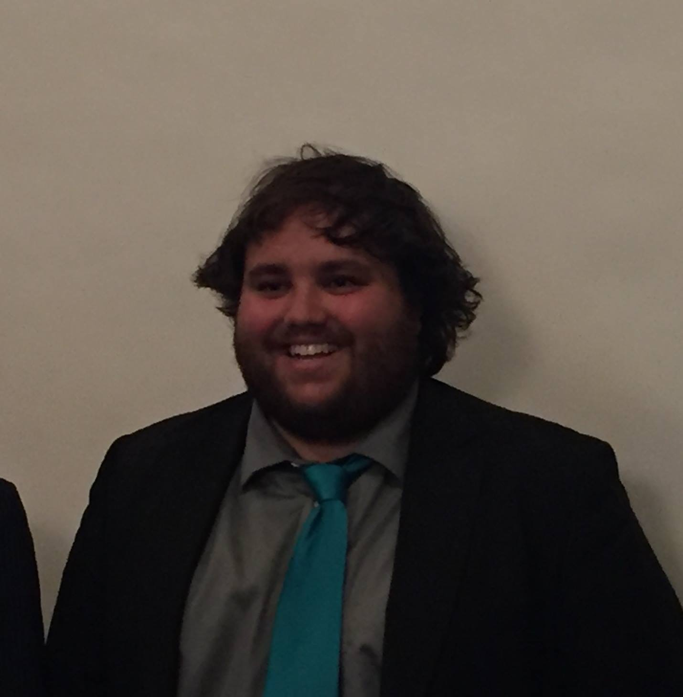

I am an Assistant Professor of Criminology in the Department of Criminal Justice and Forensic Science at Hamline University. I received my PhD in Sociology from the University of Minnesota in 2022. As a sociological criminologist, my research program is driven by an interest in how punishment in the U.S. is tied to both crime, social institutions, and social life more broadly. Building on the growing research on the causes and consequences of punishment, my scholarship explores previously neglected dimensions of crime etiology in relation to punishment as well as punishment's impacts on a wide swath of social life. My work expands upon how punishment and policing, in part, (re)produce inequalities by race, place, and crime. My scholarship places an emphasis on the innovative use of quantitative methodology, including contemporary methods of causal inference.  My dissertation investigates the iatrogenic effects of punishment on crime and other aspects of social life, using unique causal identification strategies. To read more about my research projects and dissertation [click here](research.html). To download my Curriculum Vitae [click here](cv.html). 

In my teaching, I strive to teach students not just the “social facts” within criminology, but also the process and logic of social science that provides the scientific foundation for this knowledge. I have a passion for quantitative and statistical methods and I work to convey these tools in an understandable and intuitive way. Through my teaching, I hopes my students gain both substantive knowledge and methodological tools to help them make sense of the social world, and their place within it, in order to become more responsibly engaged in society. At Hamline University I have taught criminological theory and research methods, as well as an introductory quantitative methods and statistics courses for criminology majors. 

Prior to graduate school, I received my BA in Sociology and Psychology, 
*Summa cum Laude*, from [Concordia College](https://www.concordiacollege.edu/) in 2014, and was the winner of the 2014 Farden Memorial Prize in Sociology. 

{width=65%}

