## NORC Felony Disenfranchisement Survey Experiment

Alongisde collaborators Dr. Chris Uggen (University of Minnesota), Dr. Andrew Lindner (Skidmore College), and Iris Fuglie (Hamline University undergraduate), I fielded an original survey experiment through NORC's AmeriSpeak panel to investigate the correlates of attitudes about felony disenfranchisement among Americans. Specifically, we experimentally manipulated exposure to different messages surrounding felony disenfranchisement policy (race, partisan, democracy) and are examining the treatment effects on punitive policy support and how these may be moderated by other punitive and race-based attitudes. 

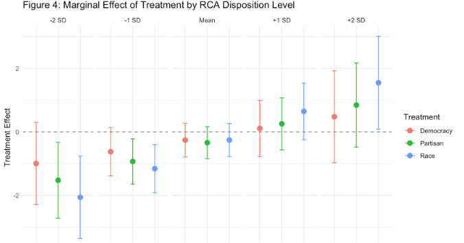

## The Patterns, Causes, and Consequences of Cash Bail in Minnesota

Alongside Dr. Josh Page and the Minnesota Justice Research Center, we are engaging in research that will help answer the question: “What are the social patterns of cash bail and pretrial justice in Minnesota, and what are the downstream consequences of these criminal legal practices?”

We propose to:
AIM 1. Descriptively examine the landscape of pretrial justice and cash bail in Minnesota. 
AIM 2. Examine the social and spatial causes and consequences of cash bail in Minnesota.
AIM 3. Examine the causal effect of cash bail on downstream criminal legal and socioeconomic outcomes. 

Methodologically, this project involves 1) descriptive analysis of the social and spatial patterns of cash bail and pretrial justice, 2) panel models investigating the social causes and consequences of cash bail at the Tract-year level, and 3) judge severity IV design identifying the causal effects of cash bail at the individual-level on downstream criminal legal and social outcomes. 

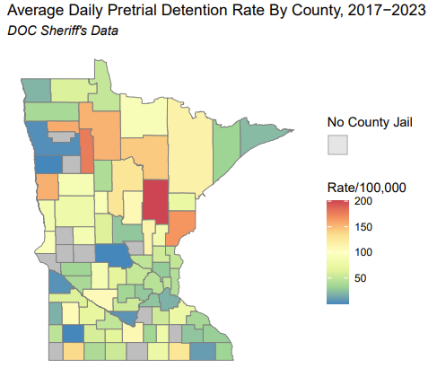

## Hennepin County Search Warrant Project (HCSWP)

Our pilot phase of the Hennepin County Search Warrant Project (HCSWP?) has consisted of a quantitative content analysis of Hennepin County Minnesota search warrants from the first three quarters of 2019. Our focal research questions are the following:
  - What is the “hit rate” (i.e., the probability of an anticipated, listed item being found in a search) of items in search warrants?
  - How frequently are confidential informants used in the search warrant process?
  - What impact do confidential informants have on the “hit rate” of items found?
  - Does the impact of confidential informants on the “hit rate” vary by item or case characteristics? 

With potential funding, we hope to expand our analytical sample to other Minnesota counties and other years to extend the external validity (i.e., generalizability) of our pilot study.  

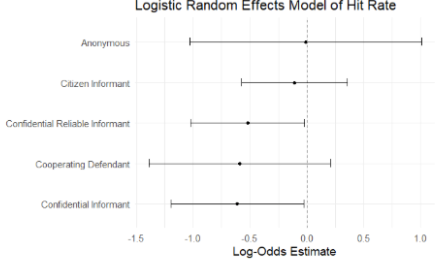

## The Iatrogenic Effects of Punishment

My dissertation examines the link between punishment and crime at three 
different levels of analysis, specifically investigating how punishment can 
exacerbate crime and criminogenic contexts, both directly and indirectly through 
its impact on existing stratification and collateral consequences. 
The quantitative analyses examine how punishment’s varied forms, intensities, 
and contexts are implicated in the (re)production of class and racial inequalities, 
the structuring of American neighborhoods and contexts, and the corrosion of 
general social health; all of which are implicated 
the genesis of crime. 

*The Causal Packaging Effects of Punishment*

The United States has experienced a marked rise across multiple forms of punishment, such as incarceration, probation, and monetary sanctions during the era of mass incarceration. However, studies examining the impacts of punishment on recidivism have a) primarily focused solely on the effects of incarceration and b) treated each axis of punishment as a separate, isolated factor, in contrast to how they are experienced as a “package” of punishment. This study leverages a natural experiment using the quasi-random assignment of judges within Minnesota Judicial Districts and estimates the causal impacts of incarceration, probation, and monetary sanctions on recidivism, while also examining how each punishment mode may condition the impact of the other. Findings indicate that the relationship between punishment and subsequent crime is weak overall, but the packaging of probation and LFOs together may be criminogenic. Further, negative effects for incarceration are only present amongst more advantaged defendants. These findings suggest that the impacts of punishment should be studied as they are experienced – as a mutually-constitutive package of confinement, surveillance, and financial costs. 

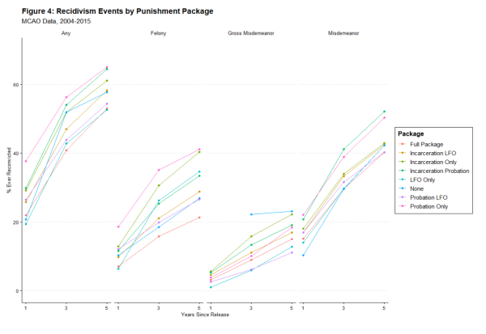{width=70%}

*Punishment, Concentrated Disadvantage, and Crime*

A long tradition of sociological and criminological research has documented the ecological effects of neighborhoods on crime rates. Theories and research on neighborhood ecology highlight the causal importance of neighborhood structure for crime, and, in particular, concentrated disadvantage. However, this literature largely neglects what role punishment, in terms of incarceration, probation, and monetary sanctions, plays in this theoretical model. Building upon previous scholarship that suggests that punishment plays a key role in the (re)production of social inequality and disadvantage, this chapter uses a unique panel dataset -- merging hospital discharge, state court punishment records, socioeconomic and demographic Census data -- to examine how neighborhood punishment loads may a) directly impact rates of violent injury, and b) impact violence indirectly through the patterning of concentrated disadvantage. Results from ZCTA (Zip Code Tabulation Area)-year fixed effect panel models highlight that while incarceration has a direct negative effect on violence, and probation a positive association, both incarceration and probation are positively associated with concentrated disadvantage, which is, in turn, positively associated with disadvantage. These results reveal the bifurcating effects of punishment on violence at the community level, and highlights a criminogenic path of punishment on violence via the augmentation of disadvantage. 

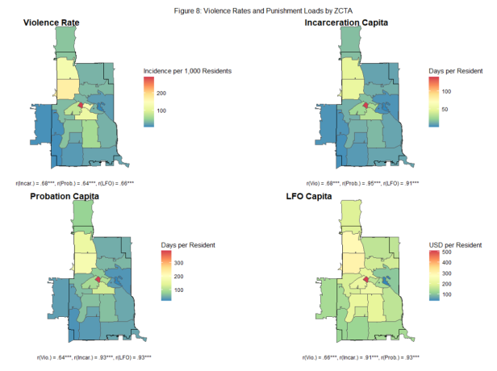{width=70%}

*Ban-the-Box, Employment, and Crime*

This empirical chapter investigates a state policy with the potential to mitigate some of the iatrogenic effects of punishment on crime via employment: ban-the-box (BTB) legislation. While previous research has investigated the effects of these policies for individual employment, questions remain as to whether these laws impact macro-level employment and, distally, crime rates. This chapter leverages a uniquely constructed panel dataset of U.S. states from 1995-2020 and estimates staggered adoption difference-in-difference (DID) models to estimate the causal effect of BTB legislation on both employment and crime at the state-level. I estimate an average treatment effect of -1.7 for nonemployment, marking BTB laws as catalysts for state-level employment, but that these effects are moderated by both race and a state’s history of criminal record production. The results on crime are much weaker, suggesting that BTB legislation does not reach to significantly reduce state-level crime. 

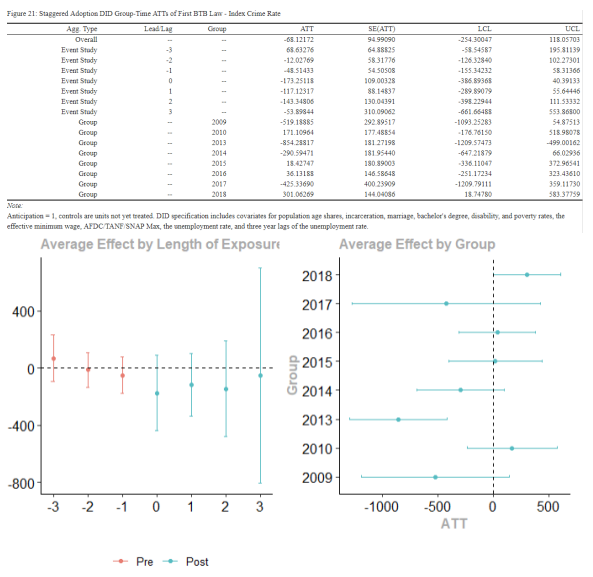{width=70%}

## Multistate Study of Monetary Sanctions

Minnesota is one of eight states included in the [Multi-State Study of Monetary Sanctions](http://www.monetarysanctions.org/), 
led by principal investigator [Alexes Harris](https://soc.washington.edu/people/alexes-harris) (University of Washington), investigating systems of monetary sanctions in the United States. Using
automated court data provided by the Minnesota State Court Administrator's 
Office, alongside interviews and ethnographic observations,  I am collaboratively
examining the role of race in the sentencing of LFOs, as well as the role of 
LFO concentrations on neighborhood poverty and housing instability. I have been investigating the extra-legal effects of race on incarceration, probation, and monetary sanctions (under review at *American Sociological Review*), as well as the impact of LFO amounts on recidivism, legal cynicism, system avoidance, and other aspects of social life. 

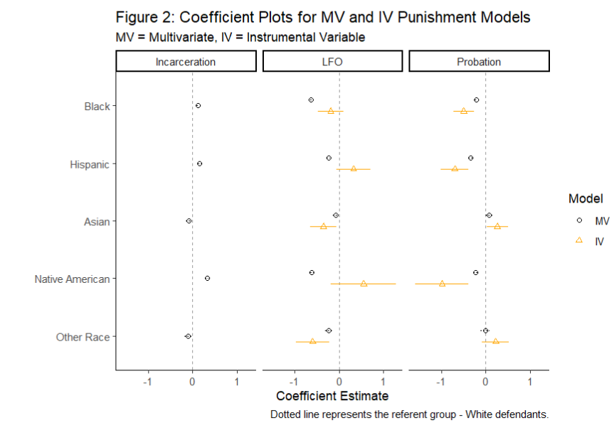{width=65%}

Moving forward, I am also collaborating with the Washington and Georgia teams to describe the relative LFO debt burden across communities, as well as the impact of LFOs on community disadvantage in both Minnesota and Washington. Further, I and the Minnesota team are investigating new methods to empirically identify punishment "packages" in administrative court data, and examine the 

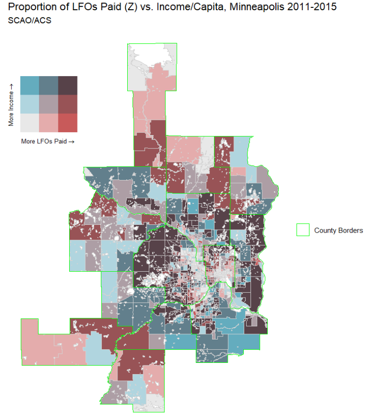{width=50%}

## Complex Relationships between Punishment, Policing, and Health

As part of a interdisciplinary collaborative team (including Jeanie Santaularia, Christopher Robertson, and Christopher Uggen), I have been investigating the relationships between punishment, policing, and health, using novel quantitative data including hospital discharge records. The first paper, published in  *Violent Epidemiology*, examines the relationships between county-level criminal punishment and violence. A second paper examines the temporal and spatial patterns in gun assault hospital discharges before and after the police killing of George Floyd using an interrupted time-series design ( *Spatial and Spatiotemporal Epidemiology*). We also have an analysis documenting the racially heterogeneous effects of the police murder of Mr. Floyd in Minneapolis (*American Journal of Epidemiology*), as well as some preliminary work examining the voting patterns surrounding Amendment 2 in Minneapolis. 

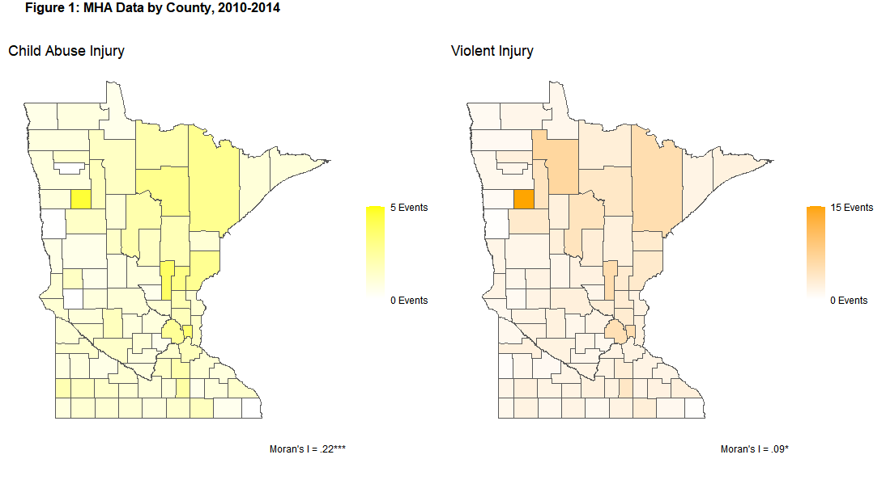{width=80%}

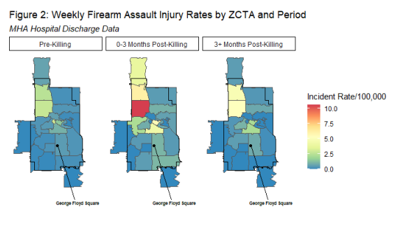{width=80%}

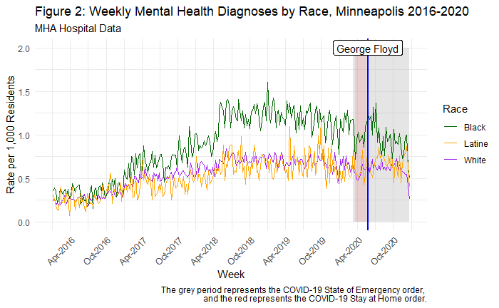{width=80%}

*Structural Racism, Police Shootings, and Health*

I have submitted a grant application as a MPI, alongside Dr. Jeanie Santaularia a collaborator of mine who is an epidemiologist at the University of Washington. We have applied for a $250,000 grant from the Fund for a Safer Future Advisory Group in their call for, “What work to prevent firearm-related death, injury, harm, trauma, and to promote healing.” Our proposed study is titled “The Causes and Consequences of Police Shootings”, and the goal of our mixed-method project is to advance knowledge on the complex interplay of historical/contemporary racism, police shootings, and health. We propose to:

AIM 1. Examine the impact of historical redlining and racial covenants2 on police shootings.
AIM 2. Examine the impact of police shootings on health.
AIM 3. Examine to what extent which police shootings mediate the relationship between historical redlining and racial covenants and health.
AIM 4. Understand how police shootings affect health outcomes, and how strategies of resilience used by community members may shape these processes. 

Briefly, one arm of our study intends to quantify the impact of spatial exposure to historical structural racism (redlining, racial covenants) on contemporary rates of police shootings at the census-tract level. We then assess the extent to which police shootings moderate the relationship between historical racial exclusion and various health outcomes (e.g., mental health, preterm birth, community firearm injuries, etc.). We hypothesize that police firearm violence is one amongst a broader suite of mechanisms that tie historical legacies of structural racism to contemporary health disparities. We also have a qualitative arm to this study, wherein we plan to conduct semi-structured interviews with Minneapolis and St. Paul residents who have been exposed to a police shooting, and investigate the experiences and strategies of resilience amongst those who encounter police firearm violence. Our theoretical model is as follows:

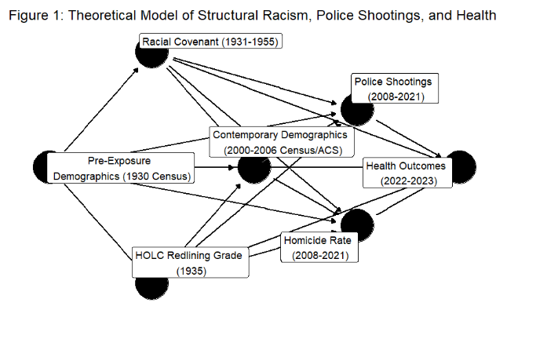{width=70%}

## Dual Debtors Project

The Dual Debtors Project is mixed-method collaborative research that examines the
nexus of criminal justice debt and child support debt. I am a Co-Investigator on a grant from the *Linda and John Arnold Foundation*  where we investigate the relationships between criminal justice and child support debt. My current work investigates
whether child support arrears are responsive to criminal justice debt, and whether these institutional forms of debt interact to pattern crime. 

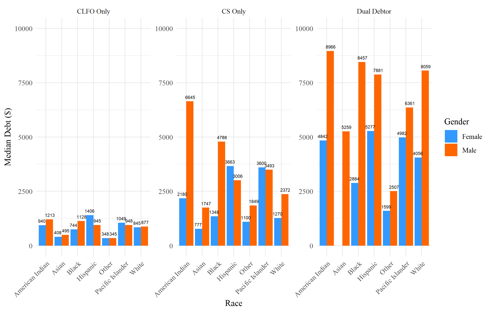{width=100%}

## Felony Disenfranchisement Estimates

Collaboratively with Chris Uggen, Sarah Shannon, and Robert Stewart, we have compiled
estimates of the population disenfranchised due to a felony record. We estimated 
that 6.1 million were legally disenfranchised due to a felony criminal record as 
of election day 2016, 5.2 million on election day 2020, and 4.6 million as of the midterm 2022 elections. Our estimates are 
published by [The Sentencing Project](sentencing project.org). In summer 2023, I am working with undergraduate student Molly Hauf as a part of Hamline's Summer Collaborative Undergraduate Research Program to construct state-level gender-specific dienfranchisement estimates. 

* [Locked Out 2022: Estimates of People Denied Voting Rights Due to a Felony Conviction](https://www.sentencingproject.org/wp-content/uploads/2022/10/Locked-Out-2022-Estimates-of-People-Denied-Voting.pdf)

* [Locked Out 2020: Estimates of People Denied Voting Rights Due to a Felony Conviction](https://www.sentencingproject.org/wp-content/uploads/2020/10/Locked-Out-2020.pdf)

* [6 Million Lost Voters: State-Level Estimates of Felony Disenfranchisement, 2016](https://www.sentencingproject.org/wp-content/uploads/2016/10/6-Million-Lost-Voters.pdf)

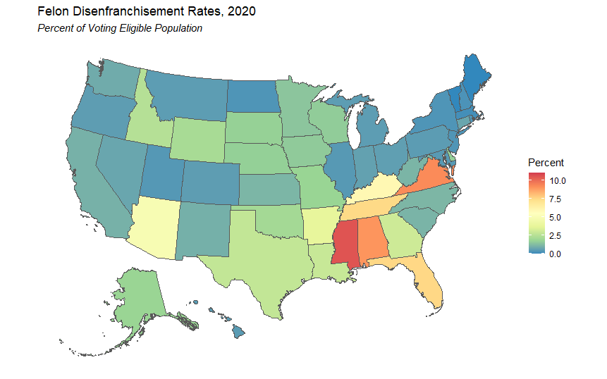{width=80%}

## American Mosaic Project

I have been a research assistant and collaborator on the 
[American Mosaic Project](https://cla.umn.edu/sociology/graduate/collaboration-opportunities/american-mosaic-project-amp),  a survey of the social boundaries of American political and religious life. 
Specifically, I have collaboratively published work on [racial colorblindness as
an identity](https://journals.sagepub.com/doi/abs/10.1177/0731121417719694?ai=1gvoi&mi=3ricys&af=R), 
and am currently working on the BAM 3.0 investigating the social causes and consequences of punitive attitudes as well as attitudes Americans hold towards individuals with criminal records.

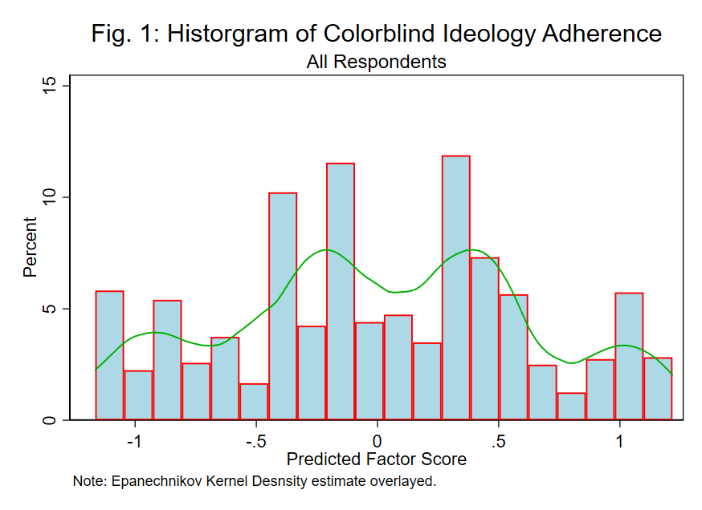{width=60%}

