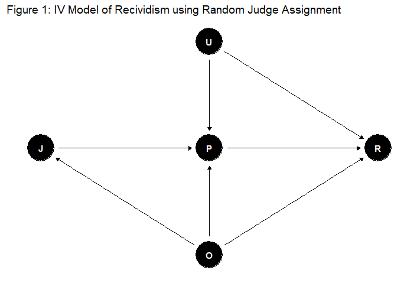
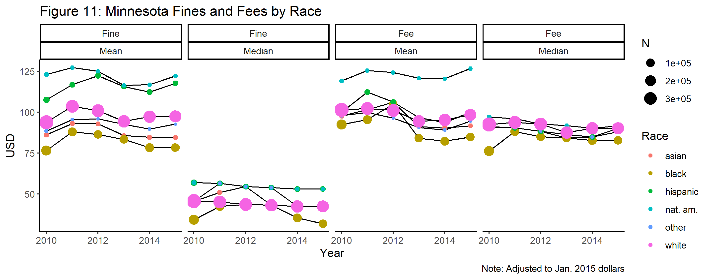
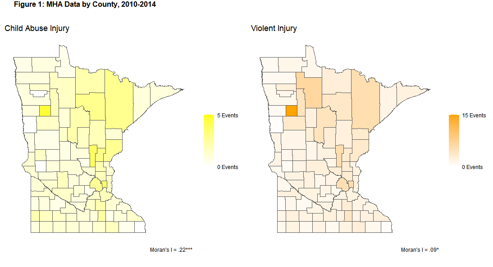
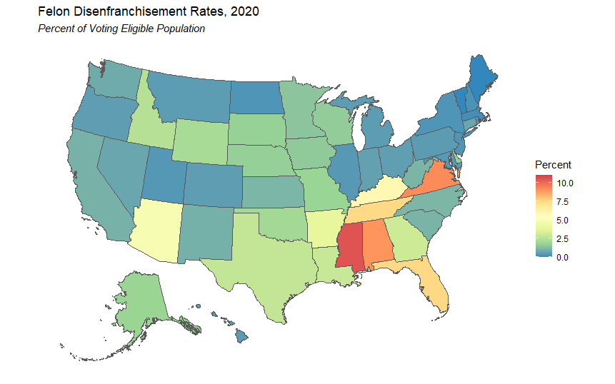
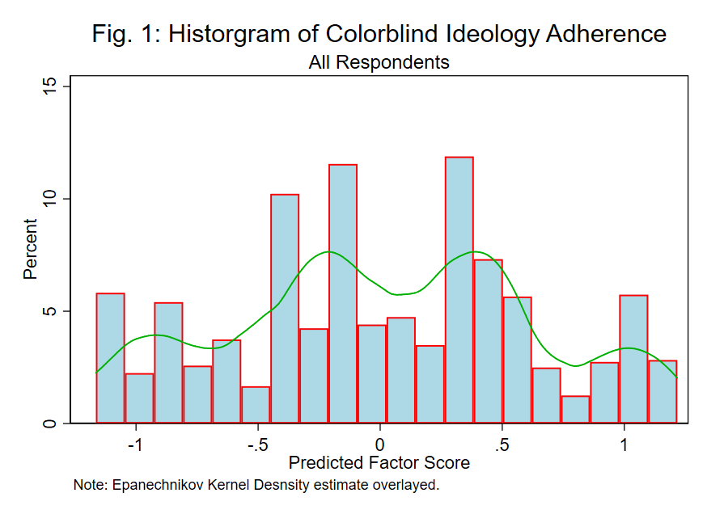

## The Iatrogenic Effects of Punishment

My dissertation examines the link between punishment and crime at three 
different levels of analysis, specifically investigating how punishment can 
exacerbate crime and criminogenic contexts, both directly and indirectly through 
its impact on existing stratification and collateral consequences. 
The quantitative analyses examine how punishment’s varied forms, intensities, 
and contexts are implicated in the (re)production of class and racial inequalities, 
the structuring of American neighborhoods and contexts, and the corrosion of 
general social health; all of which are implicated 
the genesis of crime. 

*The Causal Packaging Effects of Punishment*

The first empirical chapter uses comprehensive court data for the state of 
Minnesota to investigate the causal impacts of  “punishment packaging”  - the 
dependent combinations of different forms of punishment - on recidivism. 
The paper examines the impacts of multiple different forms (e.g., confinement, 
probation, monetary sanctions) and intensities of punishment simultaneously on 
recidivism. The analysis leverages an instrumental variable design that exploits
the random, exogenous assignment of judges within Minnesota Judicial Districts 
at the felony-level to estimate the causal effects of "punishment packaging" 
on recidivism. Further,  the analysis estimates to what extent these forms of 
punishment conditioned on not only one another, but also upon the characteristics
of defendants as well as the greater social context in which sentencing takes
place.

{width=50%}

*Punishment and Neighborhood Effects*

The second empirical paper sets neighborhood-level punishment into the 
collective efficacy/social disorganization criminological theories and asks how 
punishment operates within this system of crime etiology. The analysis uses  
panel data of neighborhoods in Minneapolis, MN, to examine the ways that varied
punishment loads (e.g., monetary sanctions per Capita) may (re)structure 
neighborhoods, and both directly and indirectly pattern crime rates. 

*Criminal Records and Social Well-Being*

The third empirical chapter uses novel estimates of the population of those with 
felony-level criminal records to examine how state-level record production has 
impacted social-well being and crime rates. Specifically, the paper looks at how
unemployment and voting turnout rates may be responsive to record production, and 
how these indicators of social well-being mediate the relationship between
the population of felony criminal record holders and state-level crime. Finally, 
the paper leverages staggered timing in both 'ban-the-box' and felony 
reenfranchisement policy in a generalized difference-in-difference design to 
investigate how state policy causally moderates the impact of criminal records.

## Multistate Study of Monetary Sanctions

Minnesota is one of eight states included in the [Multi-State Study of Monetary Sanctions](http://www.monetarysanctions.org/), 
led by principal investigator Alexes Harris (University of Washington),
investigating systems of monetary sanctions in the United States.Using
automated court data provided by the Minnesota State Court Administrator's 
Office, alongside interviews and ethnographic observations,  I am collaboratively
examining the role of race in the sentencing of LFOs and other punishments, as 
well as the impact of LFO amounts on recidivism. 

{width=90%}

## Punishment and Violence

Collaborative work has estimated the relationships between county-level punishment
and violent victimization as measured by hospital records. The first paper is forthcoming
in *Violent Epidemiology*. Current scholarship is looking at firearm victimization 
across Minneapolis, MN in the wake of events of police brutality and political protest. 

{width=90%}

## Dual Debtors Project

The Dual Debtors Project is mixed-method collaborative research that examines the
nexus of criminal justice debt and child support debt. My current work investigates
whether child support arrears are responsive to criminal justice debt, and the
criminogenic interactive impact of these forms of debt. 

## Felony Disenfranchisement Estimates

Collaboratively with my advisor Chris Uggen and Sarah Shannon, we have compiled
estimates of the population disenfranchised due to a felony record. We estimated 
that 6.1 million were legally disenfranchised due to a felony criminal record as 
of election day 2016, and 5.2 million on election day 2020. Our estimates were 
published by the [Sentencing Project](sentencing project.org). 

* [Locked Out 2020:Estimates of People Denied Voting Rights Due to a Felony Conviction](https://www.sentencingproject.org/wp-content/uploads/2020/10/Locked-Out-2020.pdf)

* [6 Million Lost Voters: State-Level Estimates of Felony Disenfranchisement, 2016](https://www.sentencingproject.org/wp-content/uploads/2016/10/6-Million-Lost-Voters.pdf)

{width=80%}

## American Mosaic Project

I have been a research assistant and collaborator on the 
[American Mosaic Project](https://cla.umn.edu/sociology/graduate/collaboration-opportunities/american-mosaic-project-amp),  a survey of the social boundaries of American political and religious life. 
Specifically, I have collaboratively published work on [racial colorblindness as
an identity](https://journals.sagepub.com/doi/abs/10.1177/0731121417719694?ai=1gvoi&mi=3ricys&af=R), 
and am currently working examining colorblind
ideology and its impacts on race-specific policy (paper currently under review).

{width=60%}

